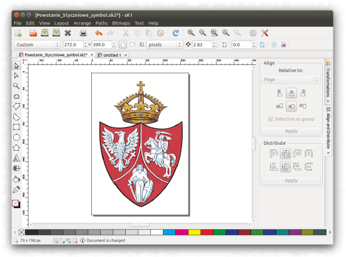

# sK1 2.0

<center>



</center>

sK1 2.0 is an open source vector graphics editor similar to CorelDRAW, 
Adobe Illustrator, or Freehand. sK1 is oriented for prepress industry, 
so it works with CMYK colorspace and produces CMYK-based PDF and PS output. 

# UniConvertor 2.0

<center>


</center>

UniConvertor 2.0 is a multiplatform universal vector graphics translator.
Uses sK1 2.0 model to convert one format to another. 

sK1 Project (http://sk1project.net)

Copyright (C) 2004-2016 by Igor E. Novikov


### How to install: 

---

* to build package:   `python setup-sk1.py build`
* to install package:   `python setup-sk1.py install`
* to remove installation: `python setup-sk1.py uninstall`

---

* to create source distribution:   `python setup-sk1.py sdist`

---

* to create binary RPM distribution:  `python setup-sk1.py bdist_rpm`
* to create binary DEB distribution:  `python setup-sk1.py bdist_deb`

---

* help on available distribution formats: `python setup-sk1.py bdist --help-formats`

---


## DETAILS

If you wish testing sK1 you have two installation ways. 
First option is a distutils install with commands:
```
python setup-sk1.py build
python setup-sk1.py install
```

(for UniConvertor use `setup-uc2.py`)

But this way is not recommended. The most preferred option is a package 
installation (deb or rpm). You can create package using command:
````
python setup-sk1.py bdist_deb (for Ubuntu|Mint|Debian etc.)
python setup-sk1.py bdist_rpm (for Fedora|OpenSuse|Mageia etc.)
````
By installing the package you have full control over all the installed files 
and can easily remove them from the system (it's important for application
preview).

### Dependencies

Please note that application uses Python 2.x version. So Python interpreter
and python based dependencies should be for 2.x, but not 3.x

For successful build either distutils or deb|rpm package you need installing
some development packages. We describe dev-packages for Ubuntu|Debian, but for
other distros they have similar names. So, you need:
````
libcairo2-dev
liblcms2-dev
libmagickwand-dev
libpango1.0-dev
python-dev
python-cairo-dev
````

To run application you need installing also:
````
python-wxgtk2.8 or python-wxgtk3.0 (for sK1 only)
python-pil 
python-reportlab
python-cairo
python-cups
````